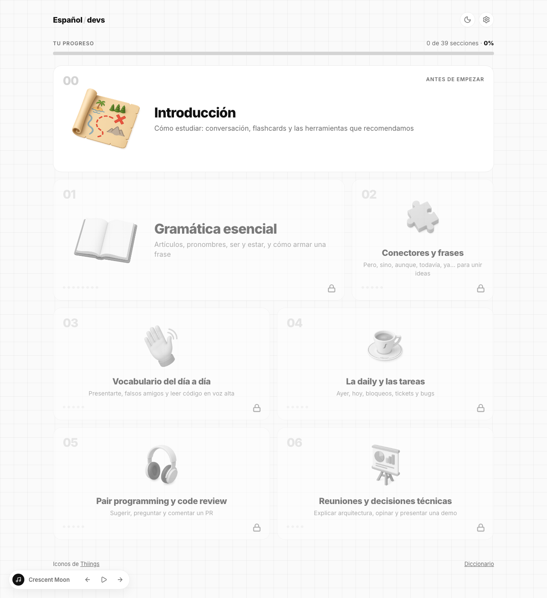

# Español/devs

Mini curso de espanhol para devs brasileiros que precisam usar o idioma no trabalho de última hora: daily, PRs, reuniões e pair programming.



## O que tem

- Uma introdução com dicas de estudo e 6 módulos, cada um com seções curtas, exercícios de completar e um desafio no final.
- Prova por módulo. Por padrão, cada módulo só libera depois da prova do anterior (dá para desligar nas configurações).
- Flashcards com repetição espaçada (FSRS): cada módulo concluído libera frases do dicionário para revisar.
- Progresso salvo no navegador (localStorage), sem login.
- Dicionário com o vocabulário do curso, tema claro/escuro e um player de música lofi.

## Rodando

Precisa de Node.js 20.19+ ou 22.12+ (exigência do Vite).

```bash
npm install
npm run dev
```

Abra o endereço que aparecer no terminal (normalmente http://localhost:5173).

Para gerar a versão de produção em `dist/`:

```bash
npm run build
npm run preview
```

## Estrutura

```
src/
  content/     conteúdo do curso (módulos, seções, provas, dicionário)
  components/  componentes de UI
  pages/       páginas (home, módulo, seção, dicionário, configurações)
  progress/    progresso do usuário
  settings/    preferências (bloqueio de módulos, música, volume)
public/        ícones e músicas
```

Para escrever ou editar conteúdo, veja [src/content/CONTENT_INSTRUCTIONS.md](src/content/CONTENT_INSTRUCTIONS.md).

## Créditos

Ícones de [Thiings](https://www.thiings.co/things). Feito por [raphaelkieling](https://github.com/raphaelkieling).
